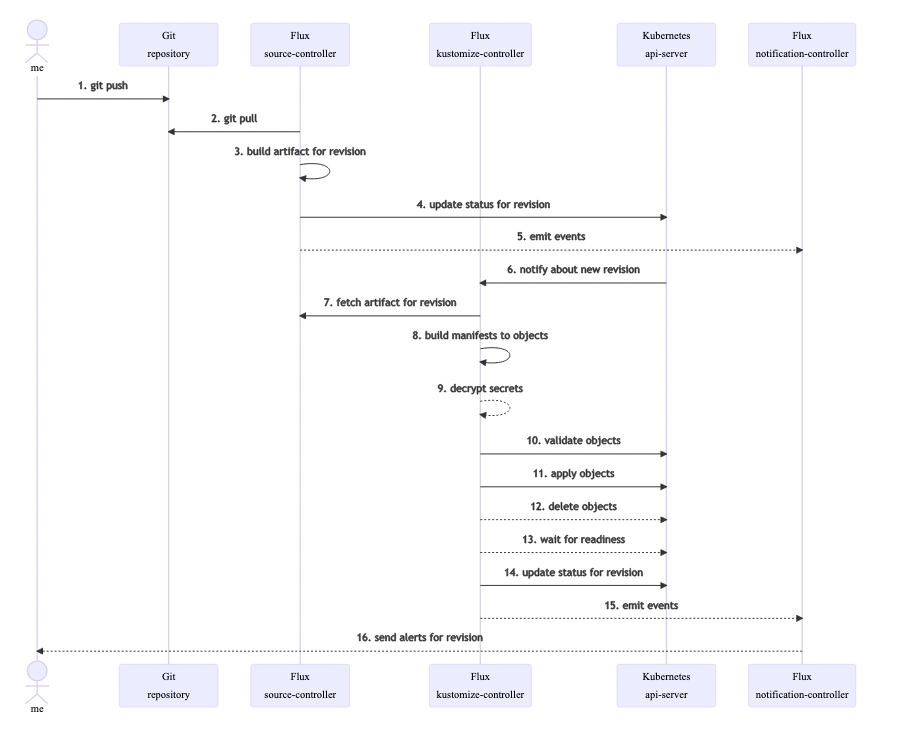
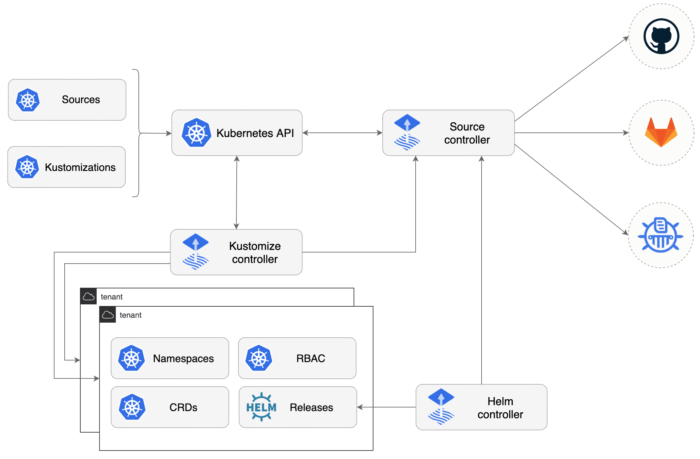

# fleet-infra

This repository holds tests and practices over FluxCD, using kind.

## FluxCD concepts

### Introduction

GitOps has been around for some time now and the process itself is not necessarily new. However, what is new are the tools that can be used to manage your GitOps workflow; namely ArgoCD and FluxCD.

There are two main scenarios in which it is very useful to adopt GitOps best practices:

- In a large team: If you are working in a large team, you do not want to give every user access to your Kubernetes resources and manage deployments. What you can do instead is to link a GitOps tool such as Flux or ArgoCD to one of your repositories — whenever a change in your Kubernetes manifests occurs or the specified branch, the GitOps tools will be responsible for pushing the update to your Kubernetes cluster.

* As an individual or collaborating with a few people: using specific cloud native tools to manage deployments is considered overkill. If you have a highly dynamic application that you would like to manage long-term, it is extremely useful to have the update process managed automatically — as can be done through ArgoCD or Flux.

### Flux Toolkit

“Flux is constructed with the GitOps Toolkit components, which is a set of

- specialized tools and Flux Controllers
- composable APIs
- reusable Go packages for GitOps under the fluxcd GitHub organisation

for building Continuous Delivery on top of Kubernetes.” (Source: Taken from the Flux docs)

In the image below you can see how they all work together:

## Requirements

- A Kubernetes cluster. In this repository we use kind.
- A GitHub personal access token with **repo permissions**. See the GitHub documentation on creating a personal

## Usage

On this repo you'll find the following commands:

1. `make up`: Starts the cluster `kind-flux-project`.
1. `make set-kind-context`: Sets the context to the `kind-flux-project`.
1. `make set-git-variables`: Allows to set Github username and token as environment variables.
1. `make bootstrap-flux`: Allows to bootstrap Flux on Kubernetes Cluster. GitHub token could be asked again.

In order to properly run this code, we suggest to follow this steps:

1. `make up`
1. `make set-git-variables`
1. `make bootstrap-flux`

And there you go!

## Flux commands usage

- `flux check --pre`: Check if everything needed by flux is present in the cluster.
